# Naturalistic-Dynamic-Network-Toolbox(NaDyNet)


## **一.** **软件概述**

基于自然刺激的动态脑网络工具箱软件是一款MATLAB的软件，适用于分析自然刺激下的任务态核磁共振数据。旨在推动自然场景神经科学的发展。

自然刺激是指内容丰富且连续的刺激，如电影或真实生活场景。研究这些刺激对脑活动的影响是当前脑科学研究中的一种新兴范式。由于自然刺激内容复杂，fMRI（功能性磁共振成像）信号也相应地变得复杂，包含了多种成分。这也是分析fMRI信号的一个主要难点。

本软件的创新点基于前人的分析fMRI信号的方法上，开创了增强版本的方法，消除无关信号的影响，分离出由自然刺激引发的信号，并实时追踪大脑对这些刺激的反应，并且取得了更加有效的结果，更加适用于自然刺激下的任务态核磁共振数据分析。

本工具箱针对于动态的脑网络方法分析后的结果，通过K均值聚类分析，求出最佳的K, 并且可以聚类出多种状态和相对应的状态转移矩阵，最终在本地保存为图片。

## 二.软硬件环境要求

### **1.** **硬件要求**

该工具箱是分析fMRI（功能性磁共振成像）数据的一款MATLAB软件，由于fMRI数据比较庞大，因此要求内存至少大于等于16G。

对于其他硬件要求，只需要你的电脑可以打开并运行MATLAB 2018a或之后的版本即可

### **2.** **软件要求**

为了能顺利的运行该MATLAB工具箱的相关功能，除了以上的硬件环境以外，还需要一定的软件支持。所需要的软件环境：

1. 操作系统：Windows 7 及以上

2. 网络环境：无要求

3. 运行平台：MATLAB 2018a及其之后的版本

4. MATLAB环境： 要求必须安装以下工具包

   (1) Medical Imaging Toolbox: 这是MATLAB 官方的一款自带的工具包，专门用于图像的处理。(一般是安装MATLAB时自带，在命令行输入如下命令, 如果显示出对应的路径则无需下载该工具包)

   ```matlab
   >> which niftiread
   C:\Program Files\MATLAB\R2022b\toolbox\images\iptformats\niftiread.m
   ```

   

   (2) [SPM](https://www.fil.ion.ucl.ac.uk/spm/software/download/): 在本工具箱中用于读写和操作fMRI文件。

   (3) [Group ICA Of fMRI Toolbox (GIFT)](https://github.com/trendscenter/gift)：用于对数据的结果进行分析。

   (4) [BrainNet Viewer](https://www.nitrc.org/projects/bnv/)： 在本工具箱中用于对3D的NII文件进行可视化，并且保存为图片。如果你无需将3D的NII文件进行可视化和保存的话，这一步是可选的。

   (5) [DCC](https://github.com/canlab/Lindquist_Dynamic_Correlation): 

   (6) [GLKF](https://github.com/PscDavid/dynet_toolbox):

   (7) [CAP_TB](https://c4science.ch/source/CAP_Toolbox/):

   以上2-7依赖的软件包可以在他们对应的超链接进行下载，如果无法下载，可以通过 [该链接](https://pan.baidu.com/s/1Fw_xOWI4y7hVJtVafRQWPQ?pwd=k2tm) 进行一次性下载。

安装完 本工具包 和 以上所提及的工具包之后，需要在Matlab-主页-设置路径，将这些Matlab工具包所在路径全部添加进去，后续只需要在matlab命令行输入以下命令，即可打开本软件使用。

```matlab
NaDyNet
```


## **三.** 软件要功能和界面

软件主界面包括三部分，分别为数据提取模块、方法选择模块和聚类与绘图模块，如图1所示。

在数据提取模块中，我们可以将一组被试的fMRI文件按照一定的规律存放到一个文件夹下，选择一个自己选定的感兴趣区掩模，即Regions of Interest(ROI) mask。提取这组被试的ROI的时间序列存放到自己设定的保存路径下。

在方法选择模块中，可分为基于感兴趣区的分析方法(ROI Method)和基于灰质体素的分析方法(Grey Matter Voxel Method)。在本软件中，如果你选择了基于灰质体素的分析方法，你是无需进行第一步的ROI时间序列的提取的。

 

1) 基于感兴趣区的分析方法（ROI Methods）：这种方法聚焦于预先定义的感兴趣区域（ROI）进行分析。ROI 可以是某个特定的脑区或其他研究者感兴趣的区域。ROI方法通常用于简化分析，减少多重比较的问题，并提高统计效能。应用场景：常用于假设驱动的研究，例如研究某个脑区在特定任务中的激活情况。

2) 基于灰质体素的分析方法，这种方法在整个大脑或特定的脑结构中，以体素为单位（通常是灰质区域）进行全脑范围的分析。这种方法通常是探索性的，没有预先定义的感兴趣区域，而是通过对所有体素进行分析，找出与实验条件相关的区域。常用于无假设或数据驱动的研究，如全脑分析，用于检测大脑不同区域的体积变化或激活模式。

 

在聚类与绘图模块中，你可以通过Best K这一功能求出最佳的K值，或者自己设定一个K值，让本工具将动态的脑网络分析方法的结果进行一个聚类，最终得出K个聚类中心也即是状态，并将这K个状态在界面上可视化，同时将这一组被试的状态转移矩阵绘制出来。


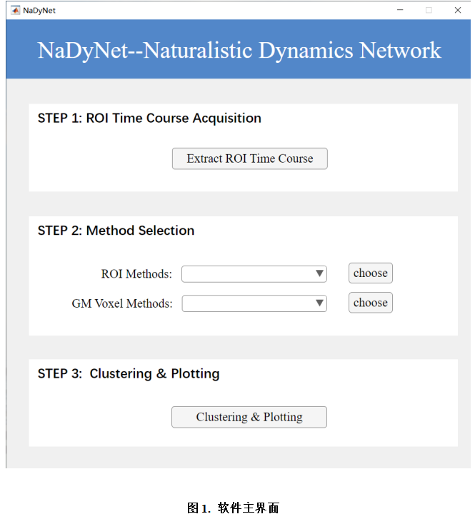

 

### **3.1 数据**提取模块

在主界面的Step 1中，通过点击Extract ROI Time Course 按钮，可以进入到数据提取模块提取模块的界面。界面如下图所示：

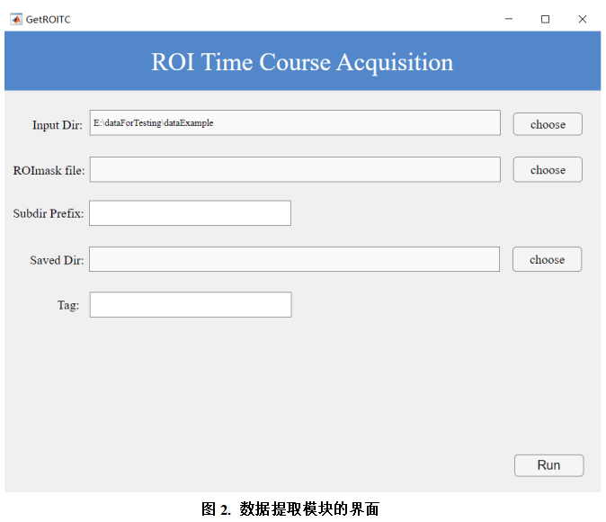

首先，我们数据的组织形式应该如下图所示，当前的目录下，有3个被试，分别为sub-UTS01、02、03，对于每一个被试对应的fMRI文件存放到一个单独的文件夹下，并且每个文件夹命名要有一定规律，例如都是以字符串‘sub’开头，这样做的目的是为了排除其他无关的文件和文件夹。

​			 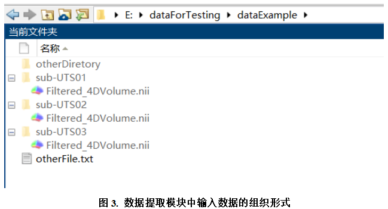

第二，我们可以自己选择一个ROI mask文件，作为一个掩模用来提取特定区域的ROI信号。注意，这里的ROI mask文件的体素大小和形状应该同被试的fMRI保持一致，否则是会出错的。

第三，由于我们的被试的文件夹是按照一定的规律命名的，所以拥有共同的字符串前缀‘sub’，我们直需要输入正确的前缀，界面就会显示识别到了多少个被试，如图4所示，当前文件夹下的被试数量有3个。

第四，选个一个保存路径用于保存相应的结果

第五，由于ROI mask种类繁多，为了对后续分析造成不必要的混淆，所以输入一个可以辨别的标签Tag，让后人知道该ROI的时间序列是在哪一个ROI mask下得到的。

  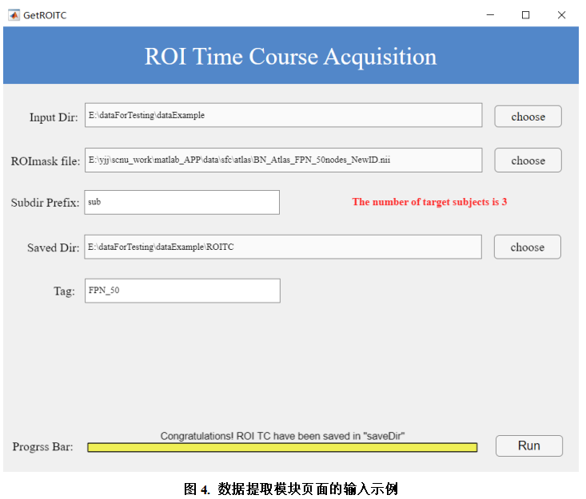

当按照上述的正确输入之后，点击按钮Run即可运行，运行成功会如图4底部所示，告知你结果已经保存在你选定的目标文件夹下面。每一个被试的ROI时间序列会有一个对于的mat文件，这是一个二维矩阵数据，行数代表了时间点的个数，列数代表了ROI的个数，结果如图5所示。

​                         

### **3.2 方法选择模块**

在方法选择模块中，包含了基于感兴趣区的分析方法(ROI Method)和基于灰质体素的分析方法(Grey Matter Voxel Method)。

#### **3.2.1 基于感兴趣区的分析方法**

基于感兴趣区的分析方法本软件实现了10种动态分析方法(动态条件相关DCC, 基于滑动窗口的动态功能链接SWFC, 可变最小二乘法FLS, 广义线性卡尔曼滤波器GLKF, 时间导数乘积MTD及其5种对应的增强版本,被试间动态条件相关ISDCC,基于滑动窗口的被试间动态功能链接ISSWFC, 被试间可变最小二乘法ISFLS,被试间广义线性卡尔曼滤波器ISGLKF, 被试间时间导数乘积ISMTD)和1种静态分析方法(静态功能链接SFC)， 共11种方法基于感兴趣区的分析方法。

接下来介绍如何使用这些方法。

​		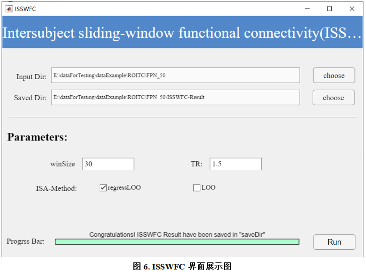

以基于滑动窗口的被试间动态功能链接ISSWFC这个方法为例子，如图6所示。


首先， 输入路径应该选择step1运行之后的结果所在的文件夹。注意，该文件夹所在的路径不可以存放其他以.mat结尾的文件。

第二， 保存路径可以自己选择或者像图6一样为默认路径。

第三， 对于无需输入的参数的方法静态功能链接SFC，则无需做第三步直接运行，否则需要跟图六一样填写相应的参数。除了SFC外，剩余的10种方法，都需要输入方法的参数才可以成功的运行。接下来介绍以下这些方法涉及的参数的含义。

1) DCC界面的参数包括了TR，TR 是指 Repetition Time，即重复时间，连续两次脉冲之间的时间间隔，取值范围需大于0(下同)。

2) SWFC界面的参数包括了winSize和TR，winSize指的是动态功能连接中滑动窗口的大小，单位是TR，通常的取值范围在[20，40]个TR之间，其取值范围应大于1，小于总TR个数。

3) FLS界面的参数包括了mu和TR。mu代表penalty weights（惩罚权重）或者加权系数。默认值为100。

4) GLKF界面的参数包括了pKF、ucKF和TR。pKF：正整数，表示模型的阶数（即 MVAR 模型的滞后阶数）。ucKF：更新常数，用于自适应地更新噪声协方差矩阵。ucKF的取值范围通常在 [0, 1] 之间。

5) MTD界面的参数包括了MTDwsize。 MTDwsize 是一个用于平滑 MTD 值的参数，它通过在特定大小的窗口（以 TR 为单位）内对 MTD 原始值进行滑动窗平均，以减少噪声对分析结果的影响。

6) 对于剩下5种对应的增强版本，界面会显示多一个参数ISA-Method，值分别为LOO和regressLOO，你可以选择两个中的其中一个作为被试间的分析方法。

LOO, 将每个被试的源数据(维度为nT * nROI, nT代表时间点个数，nROI代表感兴趣区域个数)单独留出，使用剩余数据计算群体的平均值	LOO-Mean(维度为nT * nROI），之后与源数据进行列拼接形成最终的输入数据(维度为nT * 2nROI）)。

regressLOO，是在LOO的基础上，对每个被试的源数据(维度为nT * nROI）与 LOO_Mean(维度为nT * nROI）	时间序列进行回归分析，通过去均值和添加截距项来调整数据，接	着使用回归计算得到残差，并从原始数据中减去这些残差以去除协	变量的影响。最后，处理无效数据并恢复数据的均值，返回去除协变量影响后的时间序列数据(维度为nT * nROI）。这样的数据可以大约认为回归掉了一些无关的信号(如被试的自发信号、核磁共振设备的系统噪声、被试的生理噪声)，只剩下了自然刺激引发的大脑信号。

通过被试间的ISA分析，可以一定程度提升结果的在时间和空间上的一致性。

最后， 方法运行完成之后的结果都会保存在指定的位置下，如图7所示。每一个人的结果都会对应一个以“.mat”结尾的文件。对于动态分析方法运行的结果，会额外多出一个以“_all.mat”结尾的文件里面包含了这一组被试所有的结果还有一些参数信息，是作为第三步聚类和绘图模块的输入。

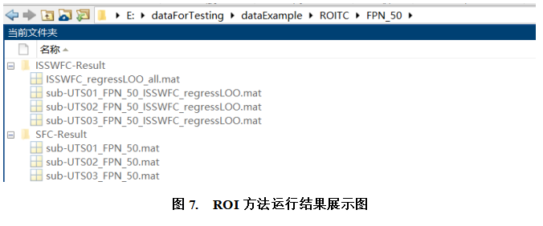

#### **3.2.2 基于灰质体素的分析方法**

基于灰质体素的分析方法本软件实现了3种，分别为共激活模式分析CAP、被试间共激活模式分析ISCAP、被试间相关ISC。

首先，介绍以下输入文件的组织形式。我们数据的组织形式应该如下图所示，当前的目录下，有3个被试，分别为sub-UTS01、02、03，对于每一个被试对应的fMRI文件和相应的头动文件存放到一个单独的文件夹下，头动文件必须以“.txt”结尾。并且每个文件夹命名要有一定规律，例如都是以字符串‘sub’开头，这样做的目的是为了排除其他无关的文件和文件夹。如果你想运行的是被试间相关ISC方法的话，是在文件夹下面放置无需头动文件的。如果你想运行的是（被试间）共激活模式分析(IS)CAP方法的话,是需要添加头动文件的，没有添加头动文件也可以运行，软件会默认为0头动。有一点需要注意的是这个头动文件的时间长度应该和fMRI文件的时间长度保持一致，否则会报错。

​			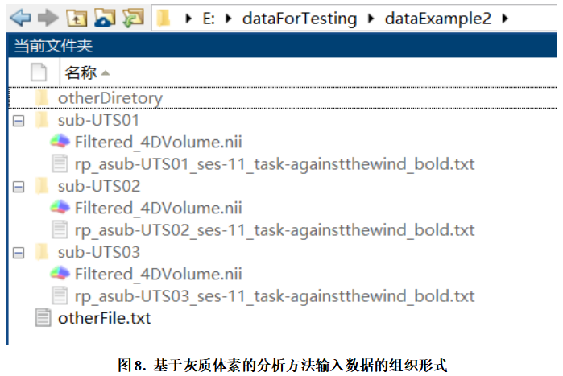

第二，被试间相关（ISC）的界面如图9所示。操作步骤如下：

（1）按照图8的规则组织好数据之后，就可以将数据所在的路径作为输入路径。

（2）并且选择一个体素和大小与源数据相对应的灰质掩模（mask）。

（3）由于我们的被试的文件夹是按照一定的规律命名的，所以拥有共同的字符串前缀‘sub’，我们直需要输入正确的前缀，界面就会显示识别到了多少个被试。

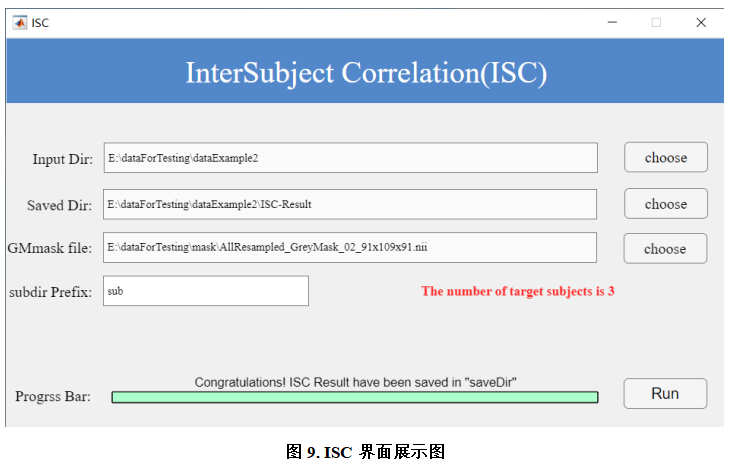

当按照上述的正确输入之后，点击按钮Run即可运行，运行成功会如图9底部所示，告知你结果已经保存在你选定的目标文件夹下面。每一个被试的ISC结果都会对应有两个 3D NII文件，一个是ISC算出来的直接结果，另外一个是在此基础上做了一次Fisher's Z 变换。运行之后结果如图10所示，如果你在MATLAB添加了[BrainNet Viewer](https://www.nitrc.org/projects/bnv/)工具包，那么每一个3D文件都会生成一个相应的TIF图片。

​				

第三，被试间共激活模式（ISCAP）的界面如图11所示。操作步骤如下：

（1）按照图8的规则组织好数据之后，就可以将数据所在的路径作为输入路径。

（2）并且选择一个体素和大小与源数据相对应的灰质掩模（mask）。

（3）由于我们的被试的文件夹是按照一定的规律命名的，所以拥有共同的字符串前缀‘sub’，我们直需要输入正确的前缀，界面就会显示识别到了多少个被试。

（4）接下来就是在页面输入合适的ISCAP参数。参数runName可以用来标识当前这组被试的数据。Tmot作为一个头动阈值，软件会根据Tmot的数值和头动文件的内容用来筛出掉fMRI那些头动较大时的帧。K代表了聚类个数，一般K的输入范围在1-12。TR 是指 Repetition Time，即重复时间，连续两次脉冲之间的时间间隔。pN, pP代表的含义分别指定应保留用于聚类的正值和负值体素的比例（其余体素则设置为零）。pN, pP的取值范围是 [1，100]。

​			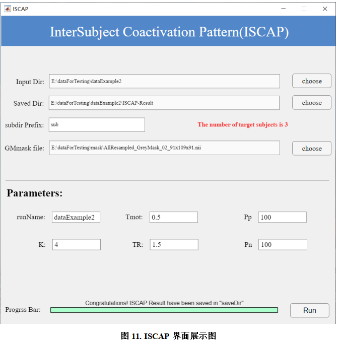

当按照上述的正确输入之后，点击按钮Run即可运行，运行成功会如图11底部所示，告知你结果已经保存在你选定的目标文件夹下面。每一个被试的ISCAP结果都会对应有两个 3D NII文件，一个是ISCAP算出来的直接结果，另外一个是在此基础上做了一次Z 分数。此外，还会生成一个状态转移矩阵的mat文件和相应的图片。

运行之后结果如图12所示，如果你在MATLAB添加了[BrainNet Viewer](https://www.nitrc.org/projects/bnv/)工具包，那么每一个3D文件都会生成一个相应的TIF图片。

​                 						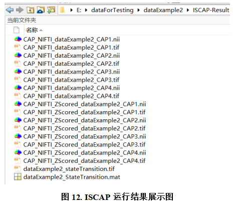

### **3.3. 聚类和绘图模块**

在此模块中，可分为3部分，分别为求最佳K值、K均值聚类分析和绘图，如图13所示。

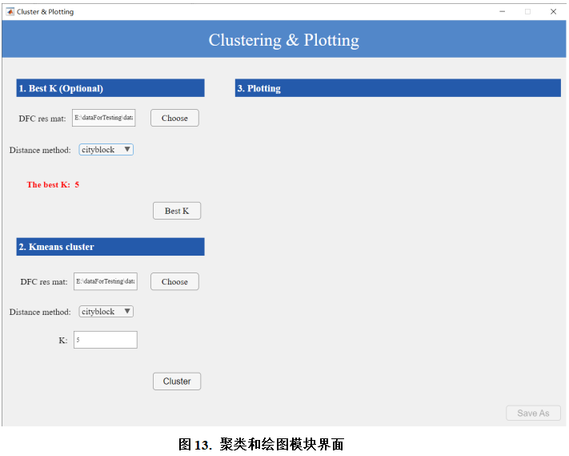

在最佳K值求解部分，用户只需要输入以“_all.mat”结尾的文件，并且选择一个求解聚类的距离方法。该“_all.mat”结尾的文件是动态分析方法运行产生的结果，该文件所在位置如图7所示。点击Best K按钮即可运行，运行之后界面会显示出最佳的K值。

在K均值聚类分析的部分，用户可以使用上一步求出的最佳的Best K，或者输入自己想要的K值。同时选择一个求解聚类的距离方法，最后点击Cluster按钮即可进行K均值聚类并在右侧生成K个状态矩阵图（矩阵大小均为nROI * nROI，其中nROI代表n个感兴趣区域）和一个状态转移矩阵图（矩阵大小均为nSub * nROI，矩阵图的大小为nSub * ( nROI * TR)，其中nSub 代表n个被试），如图14所示。

​       